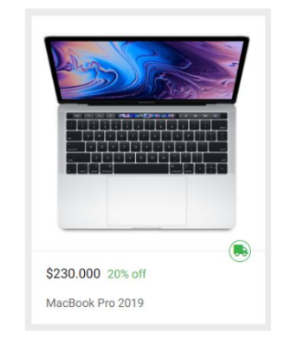
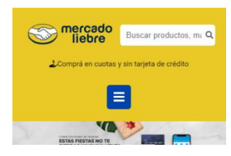
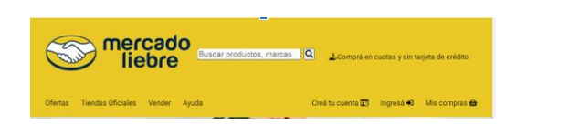

# Trabajo Practico numero 4 - Mercado Liebre - Posicionamiento con FlexBox.

## Desafio 1: Para cada unos de los articulos debemos.
- Lograr que el precio y el descuento de los artículos estén en el mismo renglón, donde el precio ocupa el 30% y el descuento el 70% del total del renglón.

****************************************************************************************************************

Mockup del desafio: 

*****************************************************************************************************************

## Desafio 2: 
 - Desarrollar la Home utilizando Flexbox, teniendo en cuenta que el sitio debe ser 100% responsive. ¿Qué debemos modificar para que, aplicando Flexbox, solo se vea un artículo si estamos en mobile, dos artículos para tablet y cuatro artículos para la versión desktop?

## Desafio 3: 
- Encabezado: nos piden que la primera parte del encabezado quede de la siguiente manera:
     - Logo: tiene que medir el 50% de su contenedor.
     - Barra de búsqueda: tiene que medir el 50% de su contenedor.

******************************************************************************************************************

- Mockup del desafio:

*******************************************************************************************************************

## Desafio 3: 
- Para dispositivos con resoluciones igual o superior a una tablet, el header debe visualizarse de la siguiente manera:

********************************************************************************************************************

- Mockup del desafio:

********************************************************************************************************************

